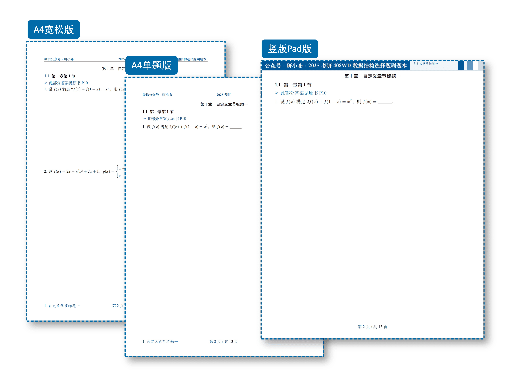

# ExBookie — 考试刷题册

一次录入题目，就能自动生成 6 种不同版式的刷题本 PDF，无需手动调整任何格式。适合考试习题册、课后练习册等场景。

<div align="center">
  
  &nbsp;
  
</div>

## 功能特点

- **6 种版式一键切换**：A4 紧凑版、A4 标准版、A4 宽松版、A4 单题版、横版 Pad 版、竖版 Pad 版。同一份题目源文件，通过文档类选项即可切换布局
- **选择题自动排版**：根据选项文字长度自动排列为 1 列、2 列或 4 列，无需手动调整
- **12 种颜色主题**：4 种经典色（蓝/绿/紫/橙）+ 8 种 MBTI 个性色，`\setThemeColor{\blue}` 一键切换，封面、页眉、题注全部跟随
- **TikZ 精美封面**：全幅背景图 + 装饰横条 + 可自定义标题/副标题/作者/座右铭
- **完整习题系统**：题组环境（`qitems`）、题目框（`bbox`）、解析环境（`analysis`）、解答环境（`solution`）、小问列表（`subqitems`）
- **代码高亮**：`lstlisting` 环境，深色/亮色双模式
- **水印系统**：支持行内文字水印和页面图片水印
- **深色模式**：`darkmode` 选项，Pad 版下全局暗色主题
- **外部配置**：`config.tex` 一站式配置封面、页眉、颜色、水印，无需修改类文件
- **截图型刷题本**：`\insertimg` 命令批量导入题目截图

---

## 如何使用

1. 配置本地 LaTeX 环境（或直接使用 Overleaf）
2. 将项目拷贝到本地（或 Overleaf）

注意：使用此项目需要一点 LaTeX 基础。

本地编译推荐使用 `latexmk`：

```bash
latexmk example_text_type.tex   # 编译
latexmk -c                      # 清理
```

也可直接使用 `xelatex`：

```bash
xelatex example_text_type.tex
```

---

## 文档类选项

### 字体选项（建议使用 `fandol`）

- `adobe`：使用 adobe 字体
- `ubuntu`：使用 ubuntu 字体
- `windows`：使用 windows 字体
- `fandol`：使用 fandol 字体，随 TeXLive 默认安装
- `mac`：使用 mac 字体

### 版式选项

- `standard`：A4 标准版。题目间约 3cm 空隙，每题内容不跨页
- `loose`：A4 宽松版。每页约 2 题
- `compact`：A4 紧凑版。题目间无空隙
- `single`：A4 单题版。每页仅一题
- `padl`：横版 Pad 版。200×150mm，适合选择题
- `padp`：竖版 Pad 版。200×250mm，适合解答题

### 其他选项

- `printmode`：双面打印模式
- `water`：全局页面水印
- `online`：封面显示在线勘误链接
- `darkmode`：深色模式（Pad 版下生效）
- `notocnum`：不显示章节编号
- `showmark`：显示页脚章节标记
- `analysis`：全文显示题目解析

---

## 封面设置

打开 `config.tex`：

```latex
\CoverImg{img/cover.jpg}
\PreTitle{ExBook · 刷题本模板}
\Title{此处填写主标题}
\TitleDescription{此处填写副标题}
\TypeOne{A4紧凑版}
\TypeTwo{A4标准版}
\TypeThree{横版Pad版}
\TypeFour{A4宽松版}
\TypeFive{A4单题版}
\TypeSix{竖版Pad版}
\motto{座右铭}
\Creator{研小布}
\UpdateTime{\today}
\OnlineCheckUrl{https://github.com/ExBook/ExBookie}
```

## 页眉页脚

```latex
\Lhead{左侧页眉}
\Chead{中间页眉}
\Rhead{右侧页眉}
\LheadC{平板模式下左侧页眉}
```

## 主题颜色

12 种颜色可选（4 种经典 + 8 种 MBTI）：

```latex
\setThemeColor{\blue}    % 经典：\blue \green \purple \orange
\setThemeColor{\infj}    % MBTI：\infj \enfp \infp \esfp \intj \entp \isfj \enfj
```

## 水印

```latex
\TextWater{文字水印内容}
\WaterImg{img/water.png}
```

---

## 题目录入

### 题组环境

```latex
\begin{qitems}[showanalysis, prefix=（, suffix=）, startnum=1]
    ...
\end{qitems}
```

可选参数：`unreset`（不重置题号）、`unshow`（隐藏题号）、`showanalysis`（显示解析）、`prefix`/`suffix`（题号前后缀）、`optprefix`/`optsuffix`（选项标签前后缀）、`startnum`（起始题号）

### 题目环境

```latex
\begin{bbox}
    \qitem 题目内容
    \fourchoices{选项A}{选项B}{选项C}{选项D}
    \begin{analysis}
        解析内容
    \end{analysis}
\end{bbox}
```

### 选择题选项

```latex
\threechoices{A}{B}{C}              % 三个选项
\fourchoices{A}{B}{C}{D}            % 四个选项
\fivechoices{A}{B}{C}{D}{E}         % 五个选项
\sixchoices{A}{B}{C}{D}{E}{F}       % 六个选项
```

选项会根据文字长度自动排列为 1 列、2 列或 4 列。

### 小问

```latex
\begin{subqitems}
    \subqitem 第一小问
    \subqitem 第二小问
\end{subqitems}
```

### 代码高亮

```latex
\begin{lstlisting}[escapeinside={(*@}{@*)}]
int main() { return 0; }
\end{lstlisting}
```

### 其他命令

| 命令 | 说明 |
|------|------|
| `\blankbox` / `\eblankbox` | 中文/英文空括号 |
| `\blankline` | 空白下划线 |
| `\textwater` | 渲染水印文字（内容在 config.tex 配置） |
| `\imgin[缩放]{对齐}{路径}` | 插入图片 |
| `\qanswerloc{页码}` | 答案位置指示 |
| `\autotilte[对齐]{标题}{副标题}` | 自由标题 |

---

## 完整示例

```latex
\documentclass[standard, analysis]{ExBook}

\begin{document}

\include{config}
\maketitle

\include{contents/pre}
\include{contents/print}

\setcounter{page}{1}
\tableofcontents
\clearpage

\section{第一章}
\subsection{第一节}\qanswerloc{10}

\begin{qitems}[showanalysis]
    \begin{bbox}
        \qitem 设$f(x)$满足$2f(x)+f(1-x)=x^2$，则$f(x)=\blankline.$
        \begin{analysis}
            $f(x)=x^2$
        \end{analysis}
    \end{bbox}
\end{qitems}

\end{document}
```

[查看完整示例 →](https://github.com/ExBook/ExBookie)
