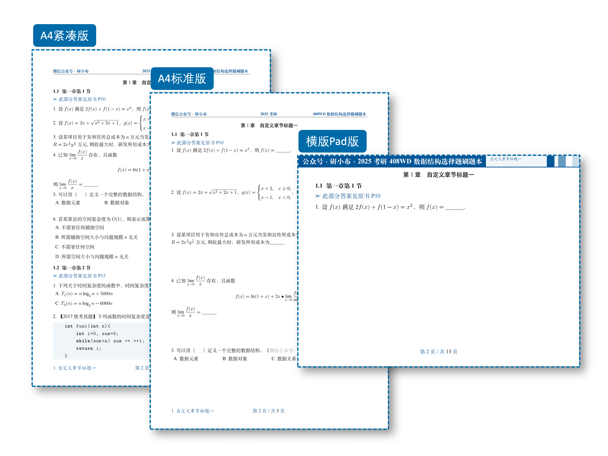
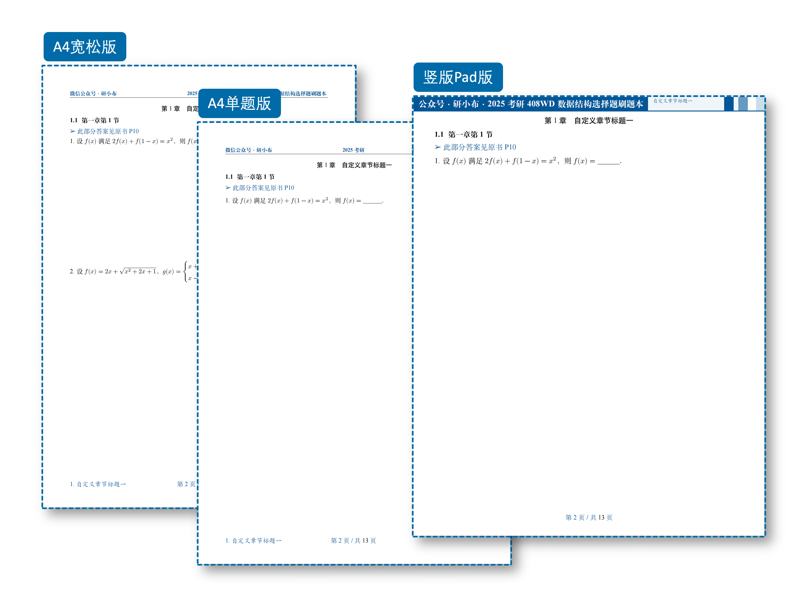

# ExBook

<!--  -->

**ExBook** 是一个专门制作做题本/刷题本的 LaTex 文档类，只录入一次题目，就可以快速生成6种版式的PDF文档（如下图）。

<!-- 

 -->

    
    

**功能特点：**

1. 录入一次题目，就可以生成6种版式（A4紧凑版、A4标准版、A4宽松版、A4单题版、横版Pad版、竖版Pad版）的PDF文档，无需手动修改任何格式；
2. 支持制作**文字录入型刷题本**以及**截图型刷题本**；
3. 支持选择题选项自动排版，可根据选项的文字长度自动排列选项；
4. 极简自定义封面、页眉、页脚等，极简插入图片，无需关注复杂的 LaTex 代码；
5. 提供12种美观易用的颜色主题，包含4种经典主题以及8种个性主题；
6. 支持自定义添加水印，包含**行内文字水印**以及**全局页面水印**；
7. 支持代码高亮。